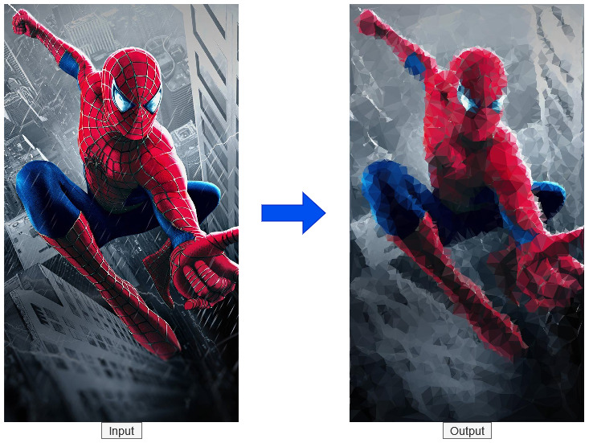

# Low Poly Generator

Woke up one day thinking about this polygon art a friend made for a college event on Photoshop, and I thought to myself how hard would it be do that in code, and that brought me to this article from [cosmiccoding][1].



While the article made use of `pygame` to read input images as well as to render the output art, I switched to using `Pillow` and making an interactive notebook to preview the output before saving the output. By dragging the slider, you can increase the number of triangles used to create the output.
|Input| Outputs|
|---|---|
|||
|||

```bash
pip install -r requirements.txt
```
Open the Jupyter notebook `final.ipynb` and run the cells till the widgets
## Learnings
- I tried using Pillow's inbuilt `convert` function to generate the Luma based grayscaling (`'L' mode`), and `ImageFilter` module to apply the Gaussian blur but since the results are still an image (`int` arrray), that messed up the sampling point generation. Spent way too much time trying to debug this
- This approach is computationally heavy
  - `get_colour_of_tri` takes ~6.8s
  - :star:  updated implementation now takes **~0.83s** (an 87% increase in speed)!


## Further Ideas
- [ ] an algorithm to identify background and subject/foreground
- [ ] algorithm to use larger sized triangles (or lower number of triangles) for background
- [ ] make code lighter for web deployment


[1]: https://cosmiccoding.com.au/tutorials/lowpoly
